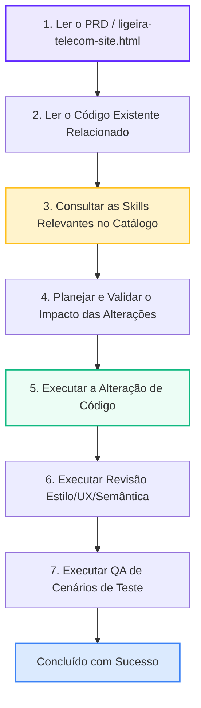

# Catálogo de Skills — Ligeira Telecom

Este diretório contém o conjunto de **28 skills especializadas** do projeto Ligeira Telecom. Essas skills estendem os comportamentos e o conhecimento dos agentes inteligentes de codificação (como o Antigravity), servindo como regras de integridade, guias de estilo, guardiões de marca e validadores técnicos.

## Regra Global Obrigatória

Antes de qualquer implementação ou modificação de código no projeto Ligeira Telecom, o agente de desenvolvimento deve **obrigatoriamente** seguir estas etapas na ordem descrita:

*Nota Crítica:* Nenhuma skill ou agente pode, em circunstância alguma, inventar requisitos, APIs, integrações, componentes, regras comerciais ou dados que não estejam formalmente documentados ou presentes na base de código ativa do projeto.

---

## Índice das 28 Skills Disponíveis

Abaixo está o catálogo completo das skills disponíveis no workspace. Clique nos links para acessar o arquivo `SKILL.md` de cada uma:

### Bloco 01 — Guardiões e Controle do PRD
*   [01 — PRD Guardian](file:///c:/workspace/Ligeira/.agents/skills/prd-guardian/SKILL.md): Valida a conformidade de novos desenvolvimentos com o escopo implícito no HTML.
*   [02 — Design System Guardian](file:///c:/workspace/Ligeira/.agents/skills/design-system-guardian/SKILL.md): Preserva cores oficiais, tipografia (Montserrat), e variáveis CSS.
*   [03 — Brand Guardian](file:///c:/workspace/Ligeira/.agents/skills/brand-guardian/SKILL.md): Garante a consistência do tom de voz e proíbe referências a concorrentes ou placeholders genéricos.

### Bloco 02 — Arquitetura de UX e Design
*   [04 — Landing Page Architecture](file:///c:/workspace/Ligeira/.agents/skills/landing-page-architecture/SKILL.md): Governa a estrutura de seções, cabeçalhos e ordem lógica da página.
*   [05 — NIO Benchmark](file:///c:/workspace/Ligeira/.agents/skills/nio-benchmark/SKILL.md): Orienta a replicação de padrões avançados de UX sem clonar a identidade de marcas externas.
*   [06 — Conversion Optimization](file:///c:/workspace/Ligeira/.agents/skills/conversion-optimization/SKILL.md): Foca no posicionamento e persuasão de CTAs e redução de barreiras de conversão.
*   [07 — Hero Section Specialist](file:///c:/workspace/Ligeira/.agents/skills/hero-section-specialist/SKILL.md): Regula a primeira dobra, widgets de velocidade e campos de busca.
*   [08 — Image Strategy](file:///c:/workspace/Ligeira/.agents/skills/image-strategy/SKILL.md): Define diretrizes de ativos de imagem, formatos otimizados e ícones.

### Bloco 03 — Consistência de Interface
*   [09 — UX Consistency](file:///c:/workspace/Ligeira/.agents/skills/ux-consistency/SKILL.md): Modula comportamentos de modais, acordeões do FAQ e rolagem de página.
*   [10 — Mobile First](file:///c:/workspace/Ligeira/.agents/skills/mobile-first/SKILL.md): Responsabilidade móvel, breakpoints (900px/600px) e áreas mínimas de toque.
*   [11 — Accessibility Guardian](file:///c:/workspace/Ligeira/.agents/skills/accessibility-guardian/SKILL.md): Acessibilidade WCAG, contraste, navegação por teclado e marcações ARIA.
*   [12 — Component Registry](file:///c:/workspace/Ligeira/.agents/skills/component-registry/SKILL.md): Catálogo de componentes existentes (botões, cards, modais) para reuso.
*   [13 — CSS Architecture](file:///c:/workspace/Ligeira/.agents/skills/css-architecture/SKILL.md): Organização e escalabilidade do Vanilla CSS crítico contido no site.

### Bloco 04 — Conteúdo e Regras de Negócio
*   [14 — Copywriter ISP](file:///c:/workspace/Ligeira/.agents/skills/copywriter-isp/SKILL.md): Redação persuasiva focada nas dores reais e benefícios de planos de internet.
*   [15 — Telecom Business Rules](file:///c:/workspace/Ligeira/.agents/skills/telecom-business-rules/SKILL.md): Protege os preços, velocidades e as 5 cidades oficiais (Juazeiro do Norte, Brejo Santo, Mauriti, Milagres, Penaforte).
*   [16 — Coverage Flow](file:///c:/workspace/Ligeira/.agents/skills/coverage-flow/SKILL.md): Fluxo de consulta (cep, gps, endereço) e redirecionamento de leads.
*   [17 — Plan Cards Specialist](file:///c:/workspace/Ligeira/.agents/skills/plan-cards-specialist/SKILL.md): Estrutura de cards de plano e destaque visual do plano principal.
*   [18 — Social Proof Engine](file:///c:/workspace/Ligeira/.agents/skills/social-proof-engine/SKILL.md): Métricas de credibilidade (10k+ clientes, 99.8% uptime) e proíbe dados inventados.

### Bloco 05 — Formulários e SEO
*   [19 — Forms Guardian](file:///c:/workspace/Ligeira/.agents/skills/forms-guardian/SKILL.md): Validação de inputs com máscaras (CPF, WhatsApp, CEP) e usabilidade de formulários.
*   [20 — SEO Specialist](file:///c:/workspace/Ligeira/.agents/skills/seo-specialist/SKILL.md): Metadados, títulos, SEO local e semântica de headings.
*   [21 — Performance Guardian](file:///c:/workspace/Ligeira/.agents/skills/performance-guardian/SKILL.md): Core Web Vitals (LCP, CLS, INP) e velocidade de carregamento.

### Bloco 06 — Integridade do Código e QA
*   [22 — Anti Hallucination](file:///c:/workspace/Ligeira/.agents/skills/anti-hallucination/SKILL.md): Trava contra criação de dados, APIs ou regras comerciais fictícias.
*   [23 — Codebase Intelligence](file:///c:/workspace/Ligeira/.agents/skills/codebase-intelligence/SKILL.md): Exigência de leitura e análise de impactos antes de alterações de código.
*   [24 — Refactoring Safety](file:///c:/workspace/Ligeira/.agents/skills/refactoring-safety/SKILL.md): Mitiga risco de regressões e preserva compatibilidade nativa de scripts.
*   [25 — Deployment Readiness](file:///c:/workspace/Ligeira/.agents/skills/deployment-readiness/SKILL.md): Checklist final pré-deploy e homologação de produção.
*   [26 — QA Automation](file:///c:/workspace/Ligeira/.agents/skills/qa-automation/SKILL.md): Define roteiros de testes funcionais para fluxos de checkout, cobertura e acordeões.

### Bloco 07 — Documentação e Revisão Sênior
*   [27 — Documentation Generator](file:///c:/workspace/Ligeira/.agents/skills/documentation-generator/SKILL.md): Atualização de walkthroughs, registros de decisões e changelogs.
*   [28 — Senior Frontend Reviewer](file:///c:/workspace/Ligeira/.agents/skills/senior-frontend-reviewer/SKILL.md): Revisão final de clean code, alinhamento visual de UI/UX, e acessibilidade.
